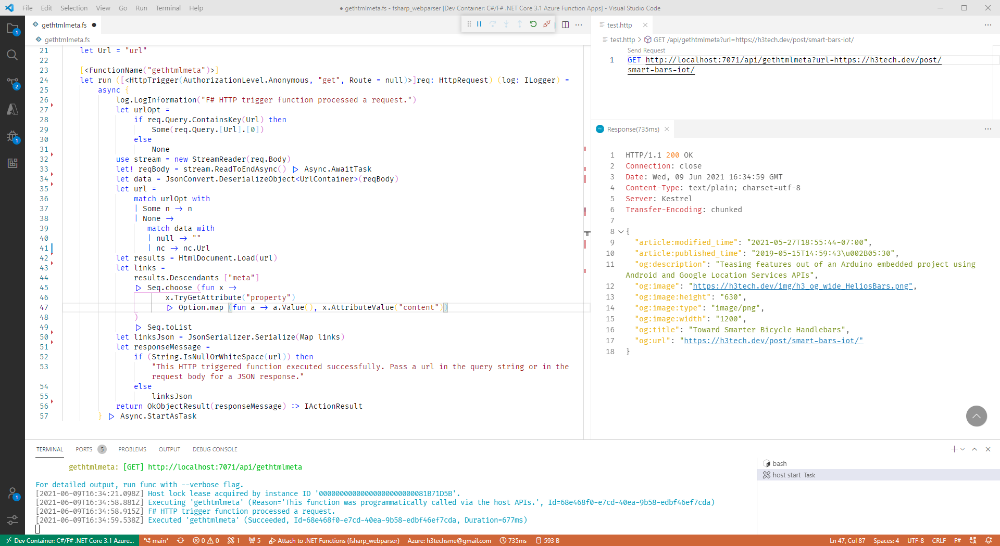

# F# Azure Function : Meta pairs from a web page head

This is my first real F# project - something I thought would be a minor stretch. I've done this type of work in C# but wanted to hone my chops with F# and work through getting serverless debug working locally. Here I want to use FSharp.Data to retrieve "meta" elements out of the head of a web page using the [HTML Parser](https://fsprojects.github.io/FSharp.Data/library/HtmlParser.html).

## The Dev Container

As you can see from the devcontainer.json I added the REST client extension so that the HTTP test file can be used for debugging. I haven't set up a bash to pull the core tools and libraries necessary, but they're listed below. My default container image is Ubuntu 20 LTS.

```bash
wget -q https://packages.microsoft.com/config/ubuntu/20.04/packages-microsoft-prod.deb
sudo dpkg -i packages-microsoft-prod.deb
sudo apt-get update
sudo apt-get install azure-functions-core-tools-3
dotnet add package FSharp.Data
dotnet add package System.Text.Json
```

The good news is that this provides direct feedback for sample requests and can run as a stand-alone host on my build machine.

## The Wrinkle

I was looking for a way to output a "clean" set of key value pairs from the meta property tags. It turns out after some head-scratching that it was a pretty straight-forward affair. I simply had to get my head wrapped around two small points in the FSharp.Data and System.Text.Json APIs.

First was to get the value of the attribute for each meta property. I had mistakenly pulled the attribute instead of the attribute **value**.

```fsharp
let links = 
    results.Descendants ["meta"]
    |> Seq.choose (fun x -> 
            x.TryGetAttribute("property")
            |> Option.map (fun a -> a.Value(), x.AttributeValue("content"))
    )
    |> Seq.toList
```

Second was to parse the list into a concise key/value record set. The part that I was missing (and I spent way too much time diverted to options which had nothing to do with it) was to add the Map function to the call. This maps the elements to the key and value position of each set. 

With just List passed directly to the JSON serializer ...

```fsharp
let linksJson = JsonSerializer.Serialize links
```

you get the following - a list with "ItemX" etc for the keys

```json

[
  {
    "Item1": "og:image",
    "Item2": "https://h3tech.dev/img/h3_og_wide_HeliosBars.png"
  },
  {
    "Item1": "og:title",
    "Item2": "Toward Smarter Bicycle Handlebars"
  }
]

// etc
```

But when you apply a Map as you pass in the list

```fsharp
let linksJson = JsonSerializer.Serialize(Map links)
```

I get the expected application of the tuples to their respective position.

```json
{
  "article:modified_time": "2021-05-27T18:55:44-07:00",
  "article:published_time": "2019-05-15T14:59:43\u002B05:30",
  "og:description": "Teasing features out of an Arduino embedded project using Android and Google Location Services APIs",
  "og:image": "https://h3tech.dev/img/h3_og_wide_HeliosBars.png",
  "og:image:height": "630",
  "og:image:type": "image/png",
  "og:image:width": "1200",
  "og:title": "Toward Smarter Bicycle Handlebars",
  "og:url": "https://h3tech.dev/post/smart-bars-iot/"
}
```


There may be situations where certain openGraph tags are not available (and other fields would need to be substituted from the page). But I'll sort that out as I encounter issues. So far all of the pages I've pulled for placement in my site have had populated tags. So it will continue to run as-is in a dev container on my local build machine and it'll continue to serve up og meta tags requested by Hugo to be embedded in the static site pages.