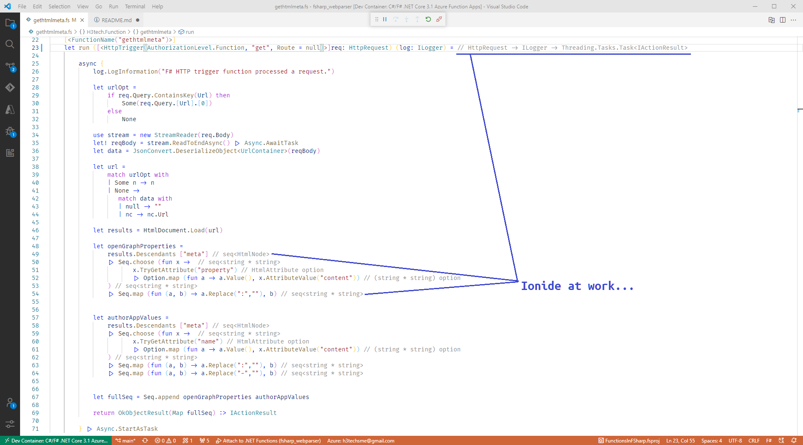

# F# Azure Function : Meta pairs from a web page head

This is my first real F# project - something I thought would be a minor stretch. I've done this type of work in C# but wanted to hone my chops with F# and work through getting serverless debug working locally. Here I want to use FSharp.Data to retrieve "meta" elements out of the head of a web page using the [HTML Parser](https://fsprojects.github.io/FSharp.Data/library/HtmlParser.html).

## The Dev Container

As you can see from the devcontainer.json I added the REST client extension so that the HTTP test file can be used for debugging. I haven't set up a bash to pull the core tools and libraries necessary, but they're listed below. My default container image is Ubuntu 20 LTS.

```bash
wget -q https://packages.microsoft.com/config/ubuntu/20.04/packages-microsoft-prod.deb
sudo dpkg -i packages-microsoft-prod.deb
sudo apt-get update
sudo apt-get install azure-functions-core-tools-3
dotnet add package FSharp.Data
```

The good news is that this provides direct feedback for sample requests and can run as a stand-alone host on my build machine.

## An Ionide Wrinkle (.NET Core 3.1 + .NET 5 = :two_hearts: )

I felt a bit ham-strung by *not* seeing Ionide "light up" in VS Code within the container. After some rather whinging on the F# slack #beginners channel some clarity emerged that **both** .NET Core 3.1 an .NET 5 needed to be available in the container. This is because .NET 5 is used by Ionide to do the real-time parsing of the code against he compiler to inform the editor layout. 



### TODOs

There may be situations where certain openGraph tags are not available (and other fields would need to be substituted from the page). But I'll sort that out as I encounter issues. So far all of the pages I've pulled for placement in my site have had populated tags. So it will continue to run as-is in a dev container on my local build machine and it'll continue to serve up og meta tags requested by Hugo to be embedded in the static site pages.